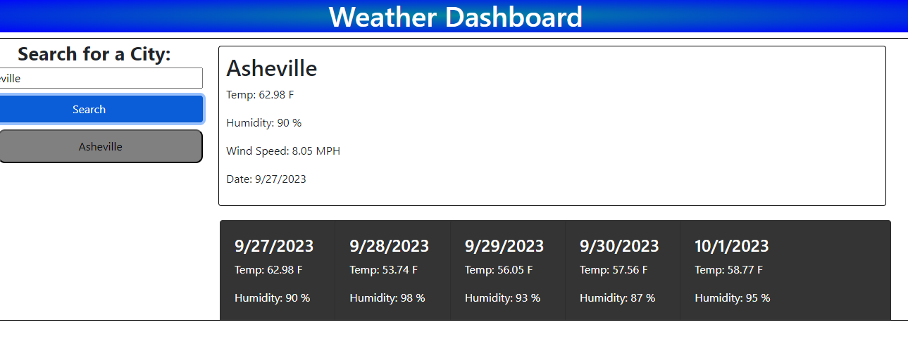

# jubilant-octo-tribble

# Steps

## Set up html file with html template and incorporate all of my links."

## Design the header and style it using CSS.

## Set up the input form using an example from bootstrap and removing the stuff that i not longer needed.

## Style the form using CSS.

## Work on recording my search history in my localstorage and having it contained in an array.

## Take the info in local storage and have it display each item within the array and have it make a button for each one.

## Set up the Api to call the information needed and then append it to the correct locations. (This took some time with trial and error)

## Fix any current bugs after putting all of the javascript code together.

# Special Thanks

## Thanks to Andrew Allen at the beginning of the challange for working with me of setting up the header and form.

 ## Thanks to Samuel Johnson for staying with me through the Javascript and us both working for hours on trying to get everything working and connected to function as we wanted.

 # Link to Deployed Application:

 ## https://zlyda1993.github.io/jubilant-octo-tribble/

 # Screenshot of Deployed Application:

 ## 